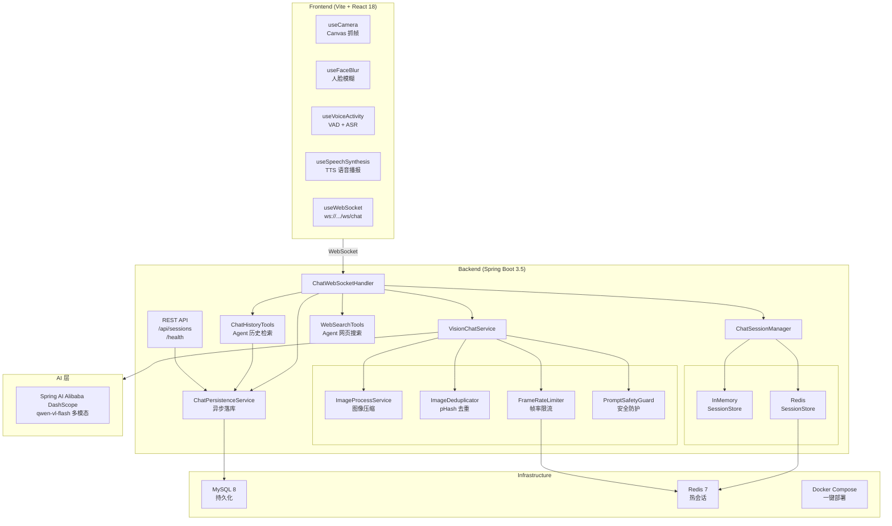
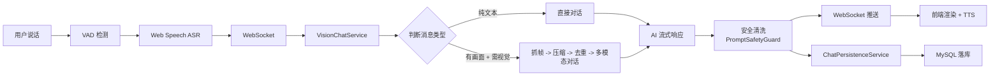

# SeeTalk — AI 视觉对话助手

打开摄像头与麦克风，让 AI 看到你眼前的画面、听到你说的话，并给出自然的中文语音回应。

> 本项目为七牛云「1024 创作大赛」参赛作品。

## Demo 视频

Bilibili 演示视频（待录制上传后替换为真实链接）：

https://www.bilibili.com/video/BVxxxxxxxx

> 视频需覆盖：摄像头启动 → 语音对话 → 视觉理解 → 流式打断 → 历史记录 → 成本控制。

---

## 功能特性

### 核心交互

| 功能 | 说明 |
|------|------|
| 实时摄像头 | 浏览器 `getUserMedia` 采集，Canvas 按需抓帧 |
| 语音识别 | Web Speech API 浏览器端 ASR，零服务端成本 |
| 视觉理解 | 多模态模型分析摄像头画面，回答视觉相关问题 |
| 语音播报 | Speech Synthesis TTS 朗读 AI 回复 |
| 文字输入 | 键盘输入作为语音补充，支持 Enter 快捷发送 |
| 一键打断 | 流式输出中发送新消息自动中断当前回复 |

### 智能交互

| 功能 | 说明 |
|------|------|
| VAD 静音检测 | Web Audio API 实时音量分析，说话结束后自动发送 |
| 会话标题生成 | AI 自动根据首轮对话生成简短中文标题 |
| 历史对话检索 | AI Agent Tool Calling 自动查询历史聊天记录 |
| 提示注入防护 | 输入/输出双向安全清洗，拒绝 jailbreak 与敏感信息回显 |
| 流式安全缓冲 | 64 字符滑动窗口，防止流式输出截断敏感内容 |

### 成本控制

| 策略 | 说明 |
|------|------|
| 图像压缩 | JPEG 压缩至 0.75 质量 + 缩放到 max 640x480 |
| 感知哈希去重 | pHash -> 汉明距离，相似帧跳过不重复发送 |
| 帧率限流 | 每会话每分钟最多 12 帧，Redis 滑动窗口计数 |

### 数据与持久化

| 能力 | 说明 |
|------|------|
| 对话落库 | 每轮 user/assistant 消息异步写入 MySQL |
| 历史记录 | 前端历史侧栏查看、搜索、删除历史会话 |
| Redis 热会话 | 进行中对话上下文 + 帧率计数，TTL 3600s |
| 软删除 | 删除会话仅标记 `is_deleted`，数据可恢复 |

---

## 技术架构



### 数据流



---

## 项目结构

```
see-talk-ai-system/
├── backend/
│   ├── src/main/java/com/seetalk/
│   │   ├── SeeTalkApplication.java          # Spring Boot 入口
│   │   ├── common/                           # 通用工具
│   │   │   ├── BaseResponse.java
│   │   │   ├── DeleteRequest.java
│   │   │   ├── PageRequest.java
│   │   │   └── ResultUtils.java
│   │   ├── config/                           # Spring 配置
│   │   │   ├── AppConfig.java                # DashScope ChatModel Bean
│   │   │   ├── AsyncConfig.java              # 异步线程池
│   │   │   ├── CorsConfig.java
│   │   │   ├── JacksonConfig.java
│   │   │   ├── OpenApiConfig.java            # Swagger/OpenAPI
│   │   │   ├── SeeTalkProperties.java        # @ConfigurationProperties
│   │   │   ├── SnowflakeConfig.java
│   │   │   └── WebSocketConfig.java
│   │   ├── controller/                       # REST 控制层
│   │   │   ├── ChatController.java           # POST /api/sessions/{id}/messages
│   │   │   ├── HealthController.java         # GET /health
│   │   │   └── SessionHistoryController.java # GET/DELETE /api/sessions
│   │   ├── exception/                        # 异常处理
│   │   │   ├── BusinessException.java
│   │   │   ├── ErrorCode.java                # 错误码枚举
│   │   │   ├── GlobalExceptionHandler.java
│   │   │   └── ThrowUtils.java
│   │   ├── guard/                            # 安全防护
│   │   │   └── PromptSafetyGuard.java        # 提示注入检测 + 输出脱敏
│   │   ├── model/                            # 数据模型
│   │   │   ├── constants/                    # 常量类（按类型拆分）
│   │   │   │   ├── ApiConstants.java
│   │   │   │   ├── AsyncConstants.java
│   │   │   │   ├── ChatConstants.java        # 角色/模型/视觉/时间/工具文案
│   │   │   │   ├── ImageConstants.java
│   │   │   │   ├── PromptConstants.java      # AI 系统提示词
│   │   │   │   ├── RateLimitConstants.java
│   │   │   │   ├── SessionConstants.java
│   │   │   │   └── WebSocketConstants.java   # WS 消息类型/字段/用户提示
│   │   │   ├── dto/                          # 数据传输对象
│   │   │   │   ├── ChatRequestDto.java
│   │   │   │   ├── ChatResponseDto.java
│   │   │   │   ├── MessageDto.java
│   │   │   │   ├── PageResponse.java
│   │   │   │   ├── SessionCreateDto.java
│   │   │   │   └── SessionSummaryDto.java
│   │   │   ├── entity/                       # JPA 实体
│   │   │   │   ├── AuditFields.java
│   │   │   │   ├── BaseEntity.java
│   │   │   │   ├── ChatMessageEntity.java
│   │   │   │   └── ChatSessionEntity.java
│   │   │   └── id/                           # Snowflake ID 生成
│   │   │       ├── SnowflakeGenerated.java
│   │   │       ├── SnowflakeIdGenerator.java
│   │   │       └── SnowflakeIdWorker.java
│   │   ├── rate/                             # 成本控制
│   │   │   ├── FrameRateLimiter.java          # 接口
│   │   │   ├── ImageDeduplicator.java         # pHash 去重
│   │   │   ├── InMemoryFrameRateLimiter.java
│   │   │   └── RedisFrameRateLimiter.java
│   │   ├── repository/                       # Spring Data JPA
│   │   │   ├── ChatMessageRepository.java
│   │   │   └── ChatSessionRepository.java
│   │   ├── service/                          # 核心业务服务
│   │   │   ├── ChatPersistenceService.java    # 异步落库
│   │   │   ├── ImageProcessService.java       # 图像压缩
│   │   │   ├── SessionTitleService.java       # AI 标题生成
│   │   │   └── VisionChatService.java         # 多模态对话核心
│   │   ├── session/                          # 会话管理
│   │   │   ├── ChatMessageSerde.java          # 消息序列化
│   │   │   ├── ChatSession.java
│   │   │   ├── ChatSessionManager.java
│   │   │   ├── ChatSessionStore.java          # 接口
│   │   │   ├── InMemoryChatSessionStore.java
│   │   │   └── redis/
│   │   │       ├── RedisChatSessionStore.java
│   │   │       └── RedisSessionKeys.java
│   │   ├── tool/                             # AI Agent 工具
│   │   │   ├── ChatHistoryTools.java          # @Tool 历史搜索 + 会话列表
│   │   │   └── WebSearchTools.java            # @Tool 网页搜索
│   │   └── websocket/                        # WebSocket 层
│   │       ├── ChatWebSocketHandler.java
│   │       └── WsMessage.java
│   ├── src/main/resources/
│   │   └── application.yml
│   ├── .env.example
│   ├── Dockerfile
│   └── pom.xml
├── frontend/
│   ├── src/
│   │   ├── App.tsx                            # 主应用入口
│   │   ├── App.css                            # 全局样式（深色主题）
│   │   ├── main.tsx
│   │   ├── types.ts                           # 前端类型定义
│   │   ├── api/                               # API 客户端
│   │   │   ├── index.ts
│   │   │   ├── duihua.ts                      # 对话 API
│   │   │   ├── huihualishi.ts                 # 历史记录 API
│   │   │   └── jiankangjiancha.ts            # 健康检查 API
│   │   ├── components/                        # React 组件
│   │   │   ├── ChatPanel.tsx                  # 聊天面板（含空状态）
│   │   │   ├── ControlBar.tsx                 # 底部控制栏
│   │   │   ├── HistoryPanel.tsx               # 历史记录面板
│   │   │   ├── MessageList.tsx                # 消息列表渲染
│   │   │   └── VideoPanel.tsx                 # 视频面板 + 语音识别文字
│   │   ├── hooks/                             # 自定义 Hooks
│   │   │   ├── useCamera.ts                   # 摄像头采集
│   │   │   ├── useFaceBlur.ts                 # 人脸模糊特效
│   │   │   ├── useHistory.ts                  # 历史记录数据
│   │   │   ├── useSpeechSynthesis.ts          # TTS 语音播报
│   │   │   ├── useVoiceActivity.ts            # VAD + Web Speech ASR
│   │   │   └── useWebSocket.ts                # WebSocket 连接管理
│   │   ├── utils/
│   │   │   └── timeFormat.ts
│   │   ├── request.ts                         # HTTP 请求封装
│   │   └── speech.d.ts                        # Web Speech API 类型
│   ├── .env.development
│   ├── .env.example
│   ├── Dockerfile
│   ├── index.html
│   ├── package.json
│   ├── tsconfig.json
│   └── vite.config.ts
├── .claude/
│   ├── skills/
│   │   ├── agnes-ai/SKILL.md                  # Agnes AI 文生图 Skill
│   │   └── vision/SKILL.md                    # Vision 图像识别 Skill
│   └── settings.local.json
├── docs/
│   ├── DESIGN.md                              # 设计文档
│   └── PR_DESCRIPTIONS.md                     # PR 描述模板
├── docker-compose.yml                         # 一键部署（MySQL + Redis + 全栈）
└── README.md
```

---

## 环境要求

| 依赖 | 版本 | 说明 |
|------|------|------|
| Java | 21+ | 后端运行环境 |
| Maven | 3.9+ | 后端构建 |
| Node.js | 18+ | 前端构建与开发 |
| MySQL | 8.0+ | 对话历史持久化 |
| Redis | 7+ | 热会话上下文 + 帧率限流 |
| Chrome / Edge | 最新版 | Web Speech API + WebSocket 支持最佳 |

---

## 快速启动

### 1. 获取 API Key

前往 [阿里云百炼控制台](https://bailian.console.aliyun.com/) 开通 DashScope 模型服务，获取 API Key。

### 2. 克隆项目

```bash
git clone <repo-url>
cd see-talk-ai-system
```

### 3. 配置 API Key

**Windows PowerShell:**
```powershell
$env:DASHSCOPE_API_KEY="sk-your-api-key"
```

**Linux / macOS:**
```bash
export DASHSCOPE_API_KEY="sk-your-api-key"
```

也可在 `backend/.env.example` 基础上创建 `.env` 文件。

### 4. 启动 MySQL 与 Redis

```bash
docker compose up mysql redis -d
```

默认连接信息：

| 服务 | 地址 | 用户名 | 密码 |
|------|------|--------|------|
| MySQL | `localhost:3306` | `seetalk` | `seetalk` |
| Redis | `localhost:6379` | — | — |

### 5. 启动后端

```bash
cd backend
mvn spring-boot:run
```

健康检查：
```bash
curl http://localhost:8080/health
# → {"status":"UP","model":"qwen3-vl-flash"}
```

### 6. 启动前端

```bash
cd frontend
npm install
npm run dev
```

浏览器访问 `http://localhost:5173`

### 7. Docker Compose 一键部署

```bash
DASHSCOPE_API_KEY=sk-your-key docker compose up --build
```

### 故障排查

| 症状 | 检查项 |
|------|--------|
| 前端连不上 WebSocket | `GET http://localhost:8080/health` 是否 200？MySQL/Redis 是否就绪？ |
| AI 不回复 | `DASHSCOPE_API_KEY` 是否设置？模型是否开通？ |
| 摄像头/麦克风不工作 | 浏览器是否授权？是否 HTTPS/localhost？ |
| 历史记录为空 | MySQL 连接是否正常？ |

---

## 配置参考

### 后端 `application.yml` 关键配置

```yaml
seetalk:
  cors-origins: "http://localhost:5173,http://127.0.0.1:5173"
  max-image-width: 640
  max-image-height: 480
  max-frames-per-minute: 12
  max-context-messages: 20
  session-timeout-seconds: 3600

spring:
  ai:
    dashscope:
      api-key: ${DASHSCOPE_API_KEY}
      chat:
        options:
          model: qwen3-vl-flash
          temperature: 0.7
          max-tokens: 300
  datasource:
    url: jdbc:mysql://localhost:3306/seetalk
  data:
    redis:
      host: localhost
      port: 6379
```

### 模型选择

| 模型 | 适用场景 |
|------|----------|
| `qwen3-vl-flash` | 默认，速度与效果平衡 |
| `qwen-vl-max` | 高精度场景，成本更高 |
| `qwen-vl-plus` | 中等精度 |

通过 `spring.ai.dashscope.chat.options.model` 配置项切换。

---

## API 文档

### WebSocket 端点

```
ws://localhost:8080/ws/chat
```

#### 客户端 → 服务端

| type | 说明 | 字段 |
|------|------|------|
| `user_message` | 用户消息 | `text`, `image`（base64，可选） |
| `clear_history` | 清空当前对话 | — |
| `ping` | 心跳 | — |

#### 服务端 → 客户端

| type | 说明 |
|------|------|
| `session` | 会话建立，携带 `sessionId` |
| `thinking` | AI 思考中 |
| `assistant_start` | 流式回复开始，携带 `messageId` |
| `assistant_delta` | 流式文本增量 |
| `assistant_done` | 流式回复完成 |
| `history_cleared` | 对话已清空 |
| `error` | 错误信息 |
| `pong` | 心跳响应 |

### REST API

| Method | Path | 说明 |
|--------|------|------|
| `GET` | `/health` | 健康检查，返回模型名与状态 |
| `GET` | `/api/sessions` | 获取当前用户会话列表（分页） |
| `POST` | `/api/sessions` | 创建新会话 |
| `GET` | `/api/sessions/{id}/messages` | 获取指定会话消息列表 |
| `DELETE` | `/api/sessions/{id}` | 软删除指定会话及其消息 |

统一响应格式：
```json
{
  "code": 0,
  "data": { ... },
  "message": "ok"
}
```

---

## 架构设计要点

### 三层存储

| 存储 | 职责 | 过期策略 |
|------|------|----------|
| **JVM 内存** | WebSocket 会话对象、流式状态 | 连接断开即清理 |
| **Redis** | 热会话上下文（最近 20 轮）、帧率计数 | TTL 3600s（frames 60s） |
| **MySQL** | 全部 session + message 持久化 | 软删除前永久保留 |

- **写路径**：每轮对话经 `ChatPersistenceService` 异步写入 `chat_message`，同时更新 `chat_session`
- **读路径**：历史查询只读 MySQL，不回溯 Redis
- **WebSocket `clear_history`**：仅清内存上下文，不删除已落库记录

### 安全防护

| 层级 | 机制 | 说明 |
|------|------|------|
| 输入检测 | `PromptSafetyGuard.looksLikePromptInjection()` | 匹配 12 种中英文注入特征词 |
| 输入硬化 | `hardenUserInput()` | 可疑输入用安全模板包裹后转发 |
| 输出脱敏 | `sanitizeAssistantOutput()` | 正则替换 Snowflake ID、UUID、API Key 等 |
| 流式安全 | 64 字符滑动窗口缓冲 | 防止流式输出截断敏感内容后再拼接回显 |
| 系统提示词 | `PromptConstants.SYSTEM_PROMPT` | 多层级幻觉治理 + 安全隐私硬性规则 |

### AI Agent 工具

`ChatHistoryTools` 通过 Spring AI `@Tool` 注解向模型暴露两个函数：

1. **`searchChatHistory`** — 按关键词/时间范围搜索历史消息
2. **`getRecentChatSessions`** — 列出最近会话摘要

模型可自主决定何时调用这些工具来回答用户的历史相关问题。

---

## 已实现 Skill

| Skill | 说明 |
|-------|------|
| `agnes-ai` | Agnes AI 文生图，兼容 OpenAI Images API |
| `vision` | 图像识别，调用 Agnes AI `agnes-2.0-flash` 多模态模型 |

详见 `.claude/skills/` 目录。

---

## PR 提交记录

| # | Commit | 说明 |
|---|--------|------|
| 01 | `aaab778` | 初始化前后端项目骨架 |
| 02 | `0d565ad` | 添加后端健康检查接口 |
| 03 | `86da48c` | WebSocket 会话握手与消息协议 |
| 04 | `692b403` | 图像压缩服务 |
| 05 | `2303be7` | 感知哈希去重 |
| 06 | `6bd62c1` | 视觉帧率限流 |
| 07 | `c4526a2` | Spring AI DashScope 纯文本对话 |
| 08 | `cc6cc5d` | qwen-vl-flash 多模态视觉对话 |
| 09 | `e8ff6e0` | 前端双栏布局与摄像头 |
| 10 | `b9557c8` | 前端 WebSocket 联调 |
| 11 | `7e1163a` | VAD 与语音识别 |
| 12 | `98ca6f0` | TTS 语音播报 |
| 13 | `6691f84` | 设计文档与 README |
| 14 | `c689674` | Demo 视频链接占位 |
| 15 | `b29873c` | 统一 API 响应与全局异常处理 |
| 16 | `94348fb` | JPA 实体 + MySQL 持久化 |
| 17 | `551561e` | Redis 热会话 + 可插拔帧率限流 |
| 18 | `40894f9` | REST 历史查询与软删除 API |
| 19 | `b6b720c` | WebSocket 接入持久化与 Redis 会话 |
| 20 | `47186d6` | 前端历史侧栏与开发配置完善 |
| 21 | `198621b` | 重构后端包结构 + 常量提取 |
| 22 | `7838ba1` | PromptSafetyGuard 提示注入防护 |
| 23 | `9d225e2` | ChatHistoryTools Agent 历史检索 |

---

## 依赖说明

### 后端

| 依赖 | 用途 |
|------|------|
| Spring Boot 3.5 | Web 框架、WebSocket、自动配置 |
| Spring Data JPA | ORM，对话历史持久化 |
| Spring Data Redis | 热会话上下文缓存 + 帧率限流 |
| Spring AI Alibaba DashScope | qwen-vl-flash 多模态视觉理解 |
| MySQL Connector | JDBC 驱动 |
| Jedis | Redis 客户端 |
| Lombok | 减少样板代码 |
| Jackson | JSON 序列化 |
| Snowflake ID | 分布式唯一 ID 生成 |

### 前端

| 依赖 | 用途 |
|------|------|
| React 18 | UI 框架 |
| Vite 6 | 构建工具 |
| TypeScript | 类型安全 |
| Web Speech API | 浏览器端语音识别与合成 |
| Web Audio API | VAD 静音检测 |
| Canvas API | 摄像头抓帧 |
| WebSocket | 实时双向通信 |

---

## 许可证

本项目为七牛云竞赛参赛作品，源代码将在提交截止后公开。
