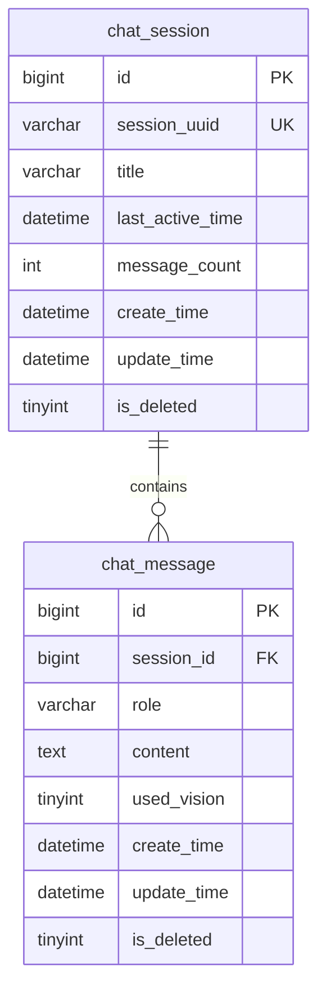

# SeeTalk 设计文档

## 1. 用户故事

### 1.1 计划实现

| ID | 用户故事 | 优先级 |
|----|----------|--------|
| US-01 | 作为用户，我点击「开始对话」后摄像头和麦克风自动开启 | P0 |
| US-02 | 作为用户，我说话后 AI 能听懂并以文字+语音回复 | P0 |
| US-03 | 作为用户，我问视觉相关问题时 AI 能结合当前画面回答 | P0 |
| US-04 | 作为用户，我可以打字输入作为语音的补充 | P1 |
| US-05 | 作为用户，我可以清空对话记录重新开始 | P1 |
| US-06 | 作为用户，我能看到 WebSocket 连接状态和是否在说话 | P1 |
| US-07 | 作为用户，在 API 未配置或权限拒绝时能看到明确错误提示 | P2 |
| US-08 | 作为开发者，我可以通过环境变量配置 DashScope API Key 和模型 | P2 |
| US-09 | 作为用户，我可以查看以往会话列表及每会话的完整对话内容 | P0 |

### 1.2 最终实现

| ID | 状态 | 实现说明 |
|----|------|----------|
| US-01 | 已实现 | `useCamera` + `useVoiceActivity` 在「开始对话」时并行启动 |
| US-02 | 已实现 | Web Audio VAD 检测静音 → Web Speech ASR → WebSocket 发送 → Speech Synthesis TTS 播报 |
| US-03 | 已实现 | 发送消息时 Canvas 抓帧 → Spring AI `UserMessage.media` → DashScope `qwen-vl-flash` |
| US-04 | 已实现 | ControlBar 文本输入框支持手动发送 |
| US-05 | 已实现 | `clear_history` WebSocket 消息同步清空前后端历史 |
| US-06 | 已实现 | 连接状态点、说话指示器、实时识别文本 |
| US-07 | 已实现 | 无 API Key、摄像头/麦克风权限、AI 调用失败均有错误气泡 |
| US-08 | 已实现 | `DASHSCOPE_API_KEY` 环境变量 + `application.yml` 可配置模型名 |
| US-09 | 已实现 | MySQL 持久化 + Redis 热会话 + 历史 API + 前端 HistoryPanel |

### 1.3 未纳入 MVP

| 功能 | 原因 |
|------|------|
| 流式输出 | 时间优先级，P1 可后续 PR 添加 |
| DashScope 云端 ASR/TTS | 成本控制，浏览器 API 零费用 |
| 用户登录与多用户 | 竞赛 MVP 不需要 |
| Redis 热会话缓存 | 已实现；TTL 3600s，历史查询仍只读 MySQL |
| 刷新页面后续聊同一 WebSocket 会话 | 需从 MySQL 回填上下文，非 MVP 必须 |

---

## 2. 数据存储设计

### 2.1 三层分工

| 存储 | 职责 | 历史查询 | 会过期吗 |
|------|------|----------|----------|
| JVM 内存 | — | 否 | — |
| **Redis** | 当前 WebSocket 最近 20 轮上下文 + 帧率计数 | 否 | TTL 3600s（frames 60s） |
| **MySQL** | 全部 session + message 文本 | **历史页唯一数据源** | 软删前永久 |

- **写路径**：每轮 user/assistant 消息经 `ChatPersistenceService` 写入 `chat_message`，并更新 `chat_session`。
- **读路径**：历史页只查 MySQL，不回溯 Redis。
- **WebSocket `clear_history`**：仅清内存上下文，**不**软删已落库记录。
- **DELETE `/api/sessions/{id}`**：软删 session 及其 messages（`is_deleted=1`）。

### 2.2 表规范（全局强制）

所有表包含以下 4 个基础字段：

| 字段 | 类型 | 说明 |
|------|------|------|
| `id` | BIGINT PK AUTO_INCREMENT | 主键 |
| `create_time` | DATETIME NOT NULL | 创建时间 |
| `update_time` | DATETIME NOT NULL | 更新时间 |
| `is_deleted` | TINYINT(1) DEFAULT 0 | 软删除：0=正常，1=已删除 |

JPA 基类 `BaseEntity` + `@SQLRestriction("is_deleted = 0")` 默认过滤已删记录。

### 2.3 ER 关系

### 2.5 Redis Key 设计（热会话）

| Key 模式 | 类型 | TTL | 说明 |
|----------|------|-----|------|
| `seetalk:session:{uuid}` | Hash | 3600s | dbSessionId、lastImageHash、lastActive |
| `seetalk:memory:{uuid}` | List | 3600s | 最近 N 条消息 JSON（role + text） |
| `seetalk:frames:{uuid}` | ZSet | 60s | 视觉帧率滑动窗口 |

每条消息后刷新 session/memory TTL，与 `session-timeout-seconds: 3600` 对齐。

---

### 2.4 历史 API

| 方法 | 路径 | 说明 |
|------|------|------|
| GET | `/api/sessions` | 分页列表，按 `last_active_time DESC` |
| GET | `/api/sessions/{id}/messages` | `{id}` 为表主键 BIGINT |
| DELETE | `/api/sessions/{id}` | 软删 session 及 messages |

---

## 3. 运营成本控制

### 3.1 想到的策略

| 策略 | 说明 |
|------|------|
| 选用小模型 | qwen-vl-flash 比 plus 系列便宜 |
| 端侧 ASR/TTS | 浏览器 Web Speech API 不计云端语音费 |
| 端侧 VAD | 静音后才发送，减少无效请求 |
| 按需单帧 | 非持续视频流上传 |
| 图像压缩 | 服务端缩放 + JPEG 压缩 |
| 感知哈希去重 | 连续相似帧跳过视觉调用 |
| 帧率限流 | 每会话每分钟上限 |
| 对话窗口截断 | 只保留最近 N 条消息 |
| 回复长度限制 | maxTokens 约 300 |
| DashScope 云端 ASR/TTS | 准确率更高但按量计费 |
| 七牛云多模型聚合 | 统一 API Key 切换模型 |
| 流式输出 | 改善体验，不直接降本 |

### 3.2 实际采用的策略

| 策略 | 实现位置 | 效果 |
|------|----------|------|
| qwen-vl-flash | `application.yml` | 降低视觉 token 单价 |
| 端侧 ASR/TTS | `useVoiceActivity.ts`, `useSpeechSynthesis.ts` | 语音链路零 API 成本 |
| 端侧 VAD | `useVoiceActivity.ts` | 避免连续发送空段/杂音 |
| 按需单帧 | `useCamera.captureFrame()` | 仅在用户发消息时上传一帧 |
| 图像压缩 640×480 JPEG75 | `ImageProcessService.java` | 减少 payload 与视觉 token |
| 感知哈希去重 | `ImageDeduplicator.java` | 静态画面连续提问时跳过视觉 |
| 帧率限流 12/min | `FrameRateLimiter.java` | 防止恶意/误操作刷 API |
| 对话窗口 20 条 | `ChatSession.trimHistory()` | 控制上下文 token |
| maxTokens 300 | `application.yml` | 限制回复长度 |
| 会话超时 3600s | `ChatSessionManager` + Redis TTL | 释放热数据与限流状态 |

### 3.3 未采用及原因

| 策略 | 原因 |
|------|------|
| DashScope ASR/TTS | MVP 优先省钱，浏览器 API 够用 |
| 七牛云 API | 已选定 DashScope 作为模型提供商 |
| 本地 Ollama | 部署复杂，72h 不优先 |
| 持续视频流 | 成本极高，与竞赛成本控制目标冲突 |

---

## 4. 技术架构摘要

- **前端**：React 18 + Vite + TypeScript
- **后端**：Java 21 + Spring Boot 3.5 + Spring AI Alibaba DashScope
- **持久化**：Spring Data JPA + MySQL（历史真相来源）
- **热会话**：Spring Data Redis（进行中对话上下文，TTL 过期不影响历史）
- **通信**：WebSocket `/ws/chat`；REST `/api/sessions` 历史查询
- **AI**：DashScope `qwen-vl-flash` 多模态对话

详见项目根目录 [README.md](../README.md)。
